# To-Do Application

A **To-Do List Application** built using Python and Flask, designed with a modular architecture to ensure scalability and maintainability. 

This application uses features such as **JWT-based authentication**, **Flask Blueprints**, and **SQLAlchemy ORM** to provide a secure, efficient, and user-friendly experience.

---

## 📋 **Key Features**

- **JWT (JSON Web Token) Authentication**: Secures API endpoints and ensures safe user sessions.
- **Flask Blueprints**: Organizes routes and separates concerns to maintain modularity.
- **SQLAlchemy ORM**: Simplifies database interaction with an object-relational mapper.
- **Flask-Bcrypt**: Encrypts user passwords to ensure secure storage.
- **RESTful API Design**: Follows REST principles for scalable backend API development.
- **Postman Testing**: Tested all endpoints with Postman for reliability.

---

## 💻 **Technology Stack**

### **Languages and Frameworks**
- **Python 3.10**: Downloaded from the official Python website ([python.org](https://www.python.org/)).
- **Flask Framework**: A lightweight Python web framework for building web applications.

### **Tools**
- **IDE**: Visual Studio Code ([VS Code](https://code.visualstudio.com/)) for coding and debugging.
- **Postman**: API testing tool downloaded from its official website ([postman.com](https://www.postman.com/)).

---

## 📂 **Project Structure**

Below is the directory structure of the project:

```
app/                      # Core application folder containing all Flask components
├── auth/                 # Blueprint for user authentication routes
│   ├── __init__.py       # Initializes the auth Blueprint
│   ├── user_login.py     # Handles user login functionality
│   ├── user_signup.py    # Handles user signup functionality
├── tasks/                # Blueprint for task-related actions
│   ├── __init__.py       # Initializes the tasks Blueprint
│   ├── task_manage.py    # Contains routes for creating, updating, and retrieving tasks
├── __init__.py           # Initializes the main Flask application
├── db_model.py           # Defines database models using SQLAlchemy
requirements.txt          # List of dependencies required for the project
run.py                    # Entry point to start the Flask application
```
---

## 🛠️ **Setup and Installation**

Follow these steps to set up the project on your local machine:

### 1. **Clone the Repository**
Clone the repository to your local machine using the following command:
```bash
git clone https://github.com/MusfirahBW/to-do-task-manager.git
cd to-do-task-manager
```
### 2. **Set Up a Virtual Environment**
Create a virtual environment to keep dependencies isolated:
```bash
python -m venv .venv
```
Then you can activate the virtual environment using these commands

```bash
.venv\Scripts\activate # for Windows
source .venv/bin/activate # for Mac/Linux
```
### 3. **Install Dependencies**
Install all required dependencies from requirements.txt:

```bash
pip install -r requirements.txt
```

### 4. **Setup Database**
Run database migrations to set up the database schema:

```bash
flask db upgrade
```
### 5. **Run the Application**
Start the application by running:

```bash
python run.py
```

Below is what your terminal should look like after running the application:
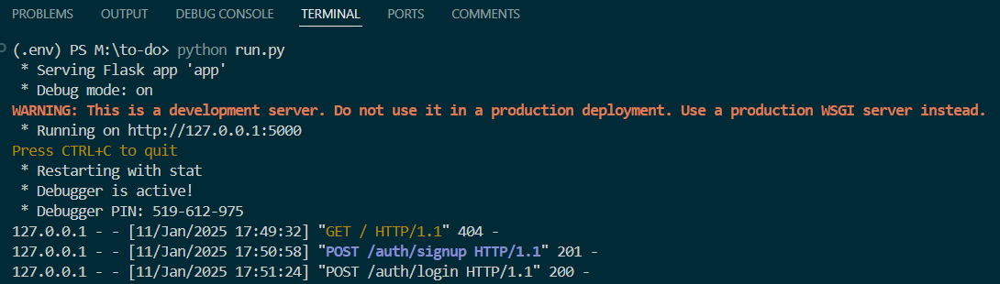

## 🚀 **Application Functionalities**

### **1\. Open Postman**

Launch Postman on your computer.
    
### **2\. Test /auth/user_signup (Register a User)**

#### Steps:

1.  **Click "New" > Request** or click the "+" tab to create a new request.
    
2.  **Set the method** to POST.
    
3.  **Enter the URL**: http://127.0.0.1:5000/auth/signup.
    
4.  Go to the **"Body" tab**.
    
    *   Select **"raw"**.
        
    *   Set the type to **"JSON"** from the dropdown.
        
    *   Enter this as the body **{ "username": "testuser", "password": "Test@1234"}**
        
5.  Click **Send**.


#### Expected Response:
You will see a message mentioning the new user registration.


### **3\. Test /auth/user_login (Log in the User)**

#### Steps:

1.  Create a new request in Postman.
    
2.  **Set the method** to POST.
    
3.  **Enter the URL**: http://127.0.0.1:5000/auth/login.
    
4.  Go to the **"Body" tab**.
    
    *   Select **"raw"** and **JSON**.
        
    *   Enter this as the body **{ "username": "testuser", "password": "Test@1234"}**
        
5.  Click **Send**.
    

#### Expected Response:
Upon successful login, return a JWT token to the user as an output.

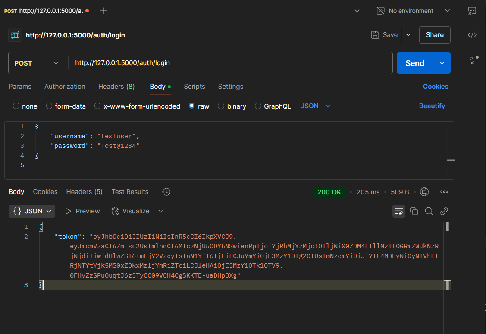


> Note: Copy the value of the token field (you will use it for the next steps).


I have registered another user too to fulfill the requirement that no two users should be able to access each other activities.

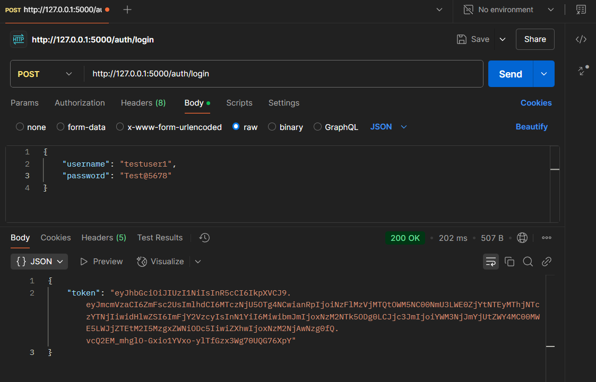

### **4\. Test /tasks Endpoints**

Now, you’ll use the **JWT token** obtained from the /auth/user_login response for these endpoints.

#### **4.1 Add a Task**

1.  Create a new request in Postman.
    
2.  **Set the method** to POST.
    
3.  **Enter the URL**: http://127.0.0.1:5000/tasks/.
    
4.  Go to the **"Headers" tab**.
    
    *   Add a new header:
        
        *   **Key**: Authorization
            
        *   **Value**: Bearer (replace your\_jwt\_token\_here with the token from /auth/user_login).
		
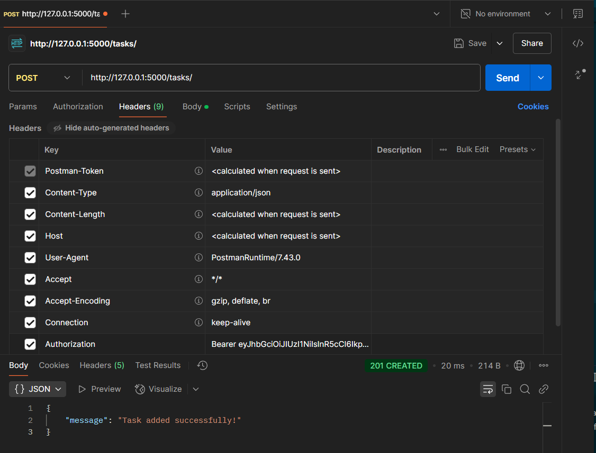
            
5.  Go to the **"Body" tab**.
    
    *   Select **"raw"** and **JSON**.
        
    *   Enter this as the body **{ "title": "Sample Task", "description": "This is a sample task description."}**
        
6.  Click **Send**.
    

#### Expected Response:
Now, you will see the output confirming that a new task has been added to the list.

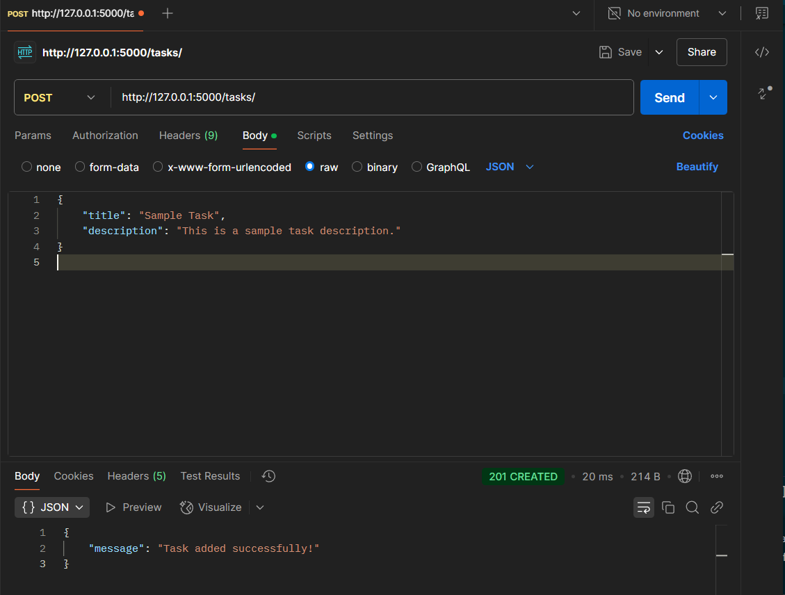

#### **4.2 View All Tasks**

1.  Create a new request in Postman.
    
2.  **Set the method** to GET.
    
3.  **Enter the URL**: http://127.0.0.1:5000/tasks/.
    
4.  Go to the **"Headers" tab**.
    
    *   Add a new header:
        
        *   **Key**: Authorization
            
        *   **Value**: Bearer your\_jwt\_token\_here.
            
5.  Click **Send**.

#### Expected Response:
Now, you can see all the task list with their description.

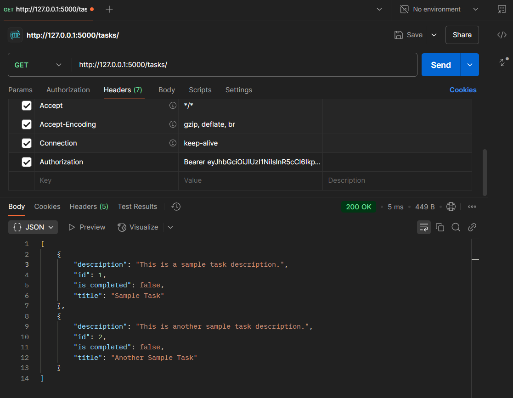

#### **4.3 Update a Task**

1.  Create a new request in Postman.
    
2.  **Set the method** to PUT.
    
3.  **Enter the URL**: http://127.0.0.1:5000/tasks/1 (replace 1 with the task ID you want to update).
    
4.  Go to the **"Headers" tab**.
    
    *   Add a new header:
        
        *   **Key**: Authorization
            
        *   **Value**: Bearer your\_jwt\_token\_here.
            
5.  Go to the **"Body" tab**.
    
    *   Select **"raw"** and **JSON**.
        
    *   Enter this as the body **{ "title": "Updated Task ID 1", "description": "Updated description of the task having the id 1."}**
        
6.  Click **Send**.
    

#### Expected Response:

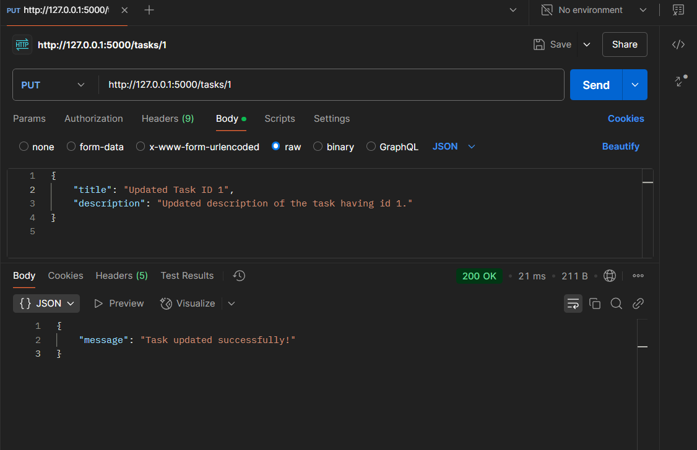

Now, if you view the task list then you will see the updated content.

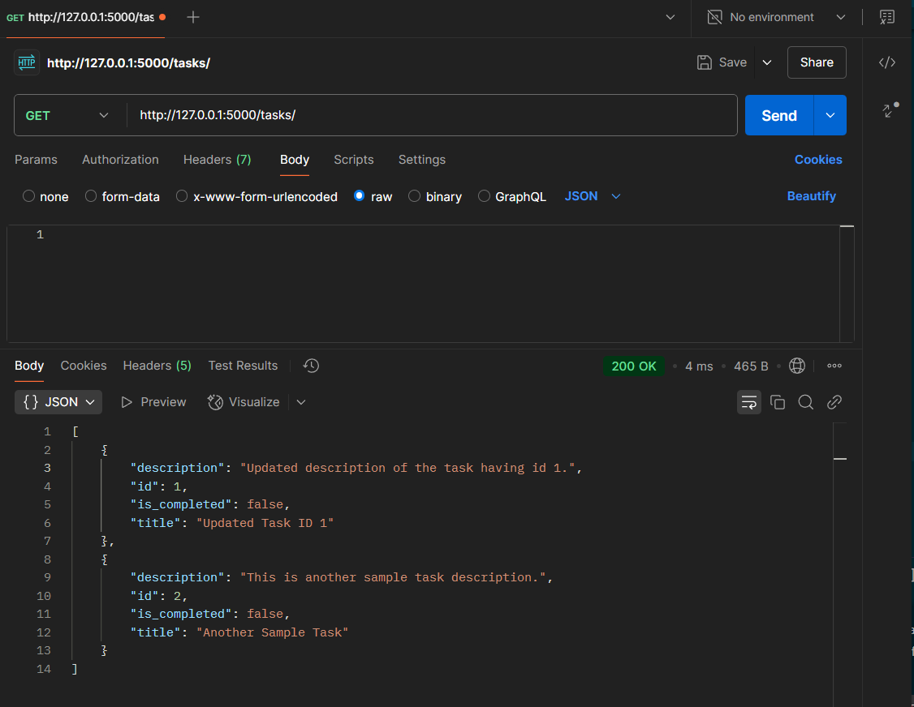

#### **4.4 Delete a Task**

1.  Create a new request in Postman.
    
2.  **Set the method** to DELETE.
    
3.  **Enter the URL**: http://127.0.0.1:5000/tasks/1 (replace 1 with the task ID you want to delete).
    
4.  Go to the **"Headers" tab**.
    
    *   Add a new header:
        
        *   **Key**: Authorization
            
        *   **Value**: Bearer your\_jwt\_token\_here.
            
5.  Click **Send**.
    

#### Expected Response:

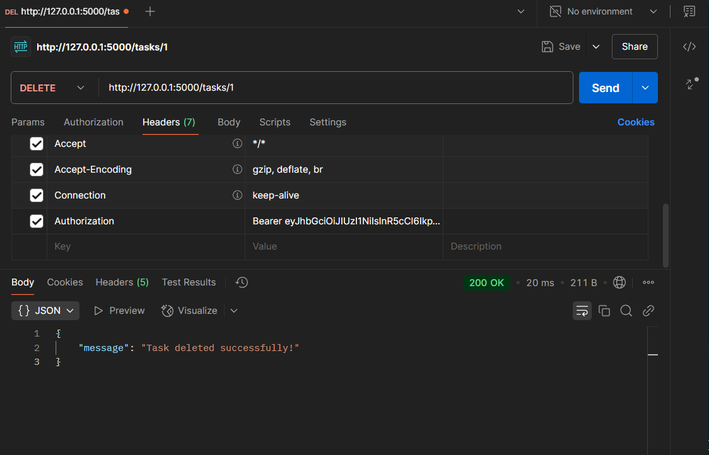

Now, if you view the task list, then you will see the deleted task is no longer there.

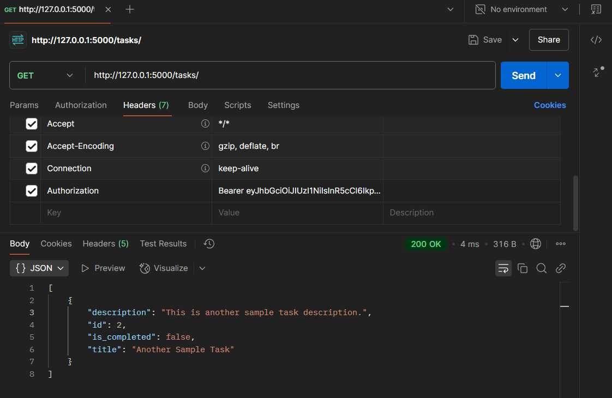

#### **4.5 Mark a Task as Completed**

1.  Create a new request in Postman.
    
2.  **Set the method** to PATCH.
    
3.  **Enter the URL**: http://127.0.0.1:5000/tasks/2/done (replace 1 with the task ID you want to mark as completed).
    
4.  Go to the **"Headers" tab**.
    
    *   Add a new header:
        
        *   **Key**: Authorization
            
        *   **Value**: Bearer your\_jwt\_token\_here.
            
5.  Click **Send**.

#### Expected Response:

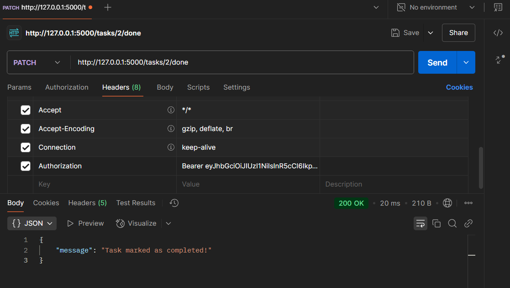

Now, if you view the task list, then you will see the updated content.

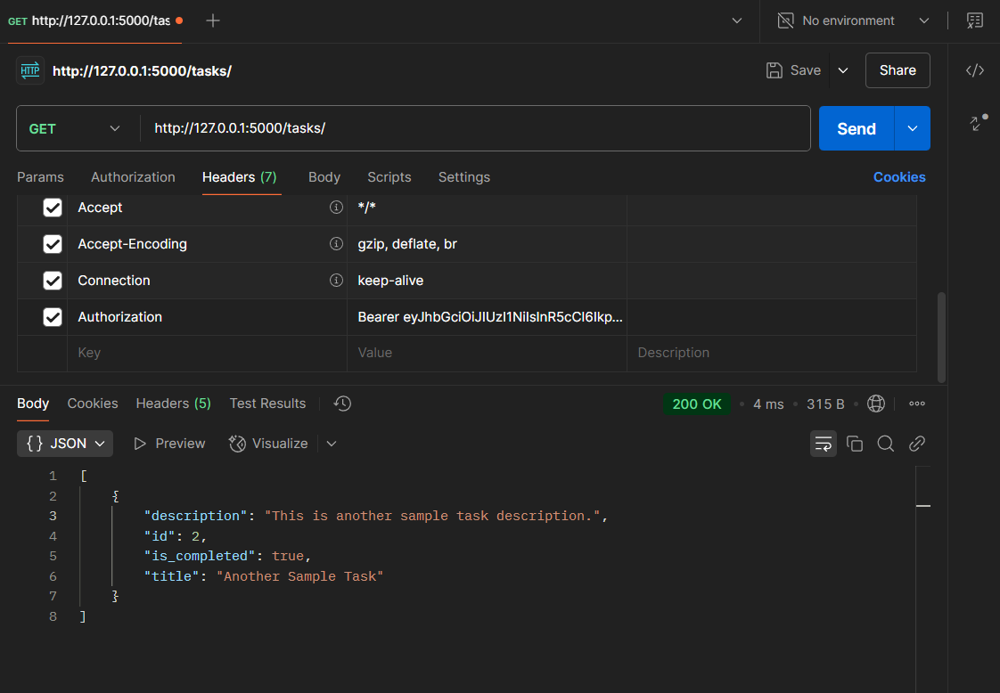

## ✔**Conclusion**
This project demonstrates how to effectively build a modular Flask application with secure user authentication using JWT tokens, database interaction via SQLAlchemy, and route management through Flask Blueprints.


